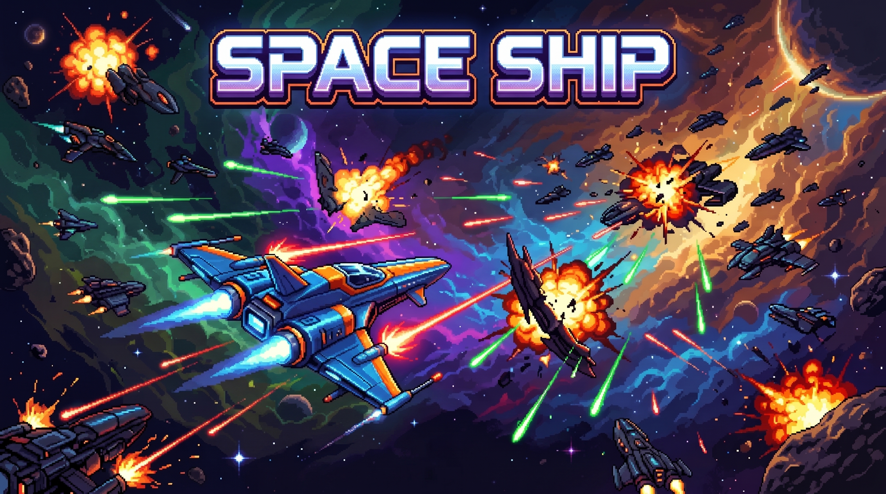

# 🚀 SpaceShip

> A fast-paced 2D space ship developed with Unity 6 and C#.

---

## 🎮 Gameplay Preview

Trailer:
[https://youtu.be/xxxxxxxx](https://youtu.be/JXzm-YuT5g4)

Play the Game:
[https://yourname.itch.io/spaceship](https://dinh-tan-thanh.itch.io/spaceship)

Portfolio: [https://dinhtanthanh.github.io](https://dinhtanthanh.github.io/project-detail.html)

---

## 📖 Overview

SpaceShip is a solo-developed 2D action game where players pilot a combat spaceship through dangerous sectors of space, battle intelligent enemies, defeat unique bosses, and collect resources to survive.

This project was created to strengthen my Unity gameplay programming skills while applying software engineering principles to build scalable and maintainable systems.

---

✨ GAME FEATURES
🚀 Fast-paced 2D space shooter gameplay
👾 Three handcrafted stages
💀 Three unique boss battles
🤖 Enemy AI with different behaviors
🎒 Inventory and item drop system
⚡ Multiple player skills and abilities
🔋 Energy (KI) management system
💥 Various enemy attack patterns
🖱️ Mouse-aimed movement and intuitive combat controls
♻️ Optimized using Object Pooling
🏗️ Modular architecture using Singleton, Observer Pattern, and ScriptableObject
🎵 Sound effects and background music
📈 Performance-focused gameplay systems

---

## 🛠 Technical Highlights

This project demonstrates my experience with:

- Unity 6
- C#
- Object Pooling
- Singleton Pattern
- Observer Pattern
- ScriptableObject
- State-based Boss AI
- Event-driven UI
- Inventory System
- Physics2D
- Scene Loading
- Audio Management

---

🎮 CONTROLS
🖱️ Mouse Cursor               – Move the spaceship toward the cursor
🔫 Left Mouse Button          – Shoot
⚡ W / A / S / D              – Instantly dash in the pressed direction
↖️ W+A, W+D, S+A, S+D         – Dash diagonally
🚀 1 / 2 / 3 / 4 / 5 / 6 / 7  – Activate spaceship skills

---

## 🏗 Architecture

Core Systems

Player

Enemy AI

Boss AI

Inventory

Audio Manager

Object Pool

Scene Manager

UI

Game Manager

---

## 📈 Performance Optimization

Implemented Object Pooling to eliminate unnecessary runtime instantiation and reduce garbage collection spikes during intense combat.

Gameplay systems were designed with modular architecture to simplify future expansion and maintenance.

---

## 📚 What I Learned

During this project I improved my understanding of:

- Gameplay Programming
- Software Architecture
- Design Patterns
- Performance Optimization
- AI Behaviour
- Unity UI
- Project Organization

---

## 🧰 Built With

- Unity 6
- C#
- Visual Studio
- Git
- GitHub

---

## 👤 Developer

Đinh Tấn Thành

Unity Game Developer

LinkedIn:
[https://www.linkedin.com/in/dinhtanthanh](https://www.linkedin.com/in/dinhtanthanh/)

Portfolio:
https://dinhtanthanh.github.io/

Email:
dinhtanthanh19@gmail.com
